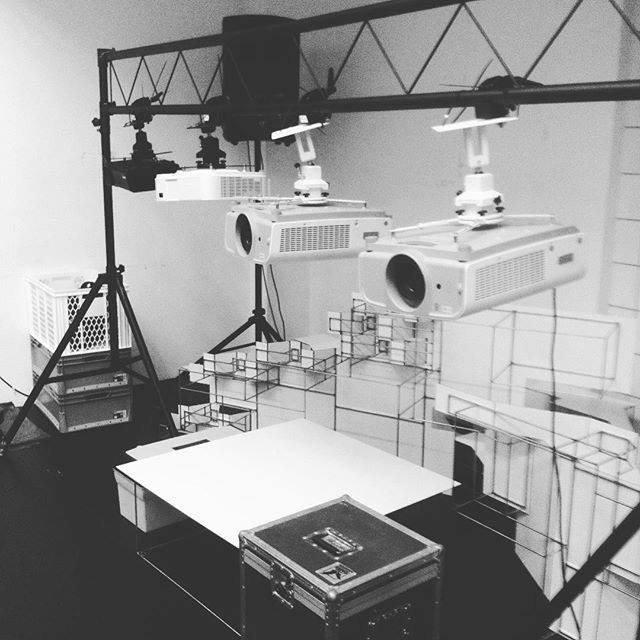
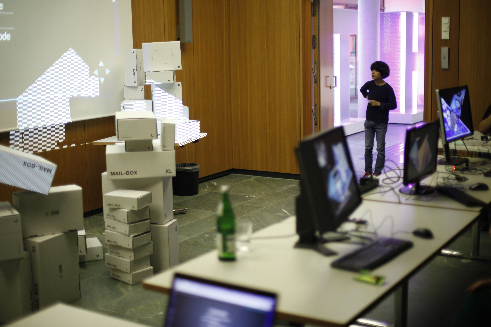

slidenumbers: true
autoscale: true
footer: © Krisjanis Rijnieks 2016


# [fit] Projection Mapping
# [fit] with the Raspberry Pi

---

# [fit] Network Config

Network is important. We are going to use a wireless network that has been specifically created for the workshop. Use the data below.

SSID: *Projection Mapping*
PASS: *raspberrypi*

---

# [fit] Slides

You can find this presentation on **GitHub**. It has been made with Markdown and **Deckset**. Follow the links below.

**GitHub**
https://github.com/kr15h/projection-mapping-with-rpi

**Deckset**
http://decksetapp.com

---

# [fit] Facts About
# [fit] Krisjanis Rijnieks

 - From Riga, Latvia
 - Studied New Media at the Helsinki Media Lab
 - Currently is a part of Fab Lab Berlin
 - Developer of ofxPiMapper, runs projection mapping workshops
 - Interested in projects connected to creative coding, digital fabrication and projection mapping


---

# [fit] More About 
# [fit] Krisjanis Rijnieks

**Website**
http://rijnieks.lv

**GitHub**
https://github.com/kr15h

**LinkedIn**
https://www.linkedin.com/in/krisjanisrijnieks


---

## What is Projection Mapping

One can turn almost any surface into a screen by using projection mapping.[^1]


---

## What is Projection Mapping

Here is what you need.

 - A computer
 - A projector
 - A surface
 - Some electricity



---

## History

In fact, projection mapping is nothing new. Hans Holbein the Younger did it in 1533 already.[^2]


---

## History

He used anamorphism, perspective distortion, to paint the symbols of mortality and death into his project so it can only be seen from an angle.[^3]


---

## Current Status

Currently projection mapping is mostly associated with transforming the facades of historical buildings.[^4]


---

## Current Status

Or stage design for electronic music shows like the ISAM project by Amon Tobin.[^5]


---

## Today

We are going to have a quick walktrhough on how to set up a simple projection mapping installation by using ofxPiMapper and the Raspberry Pi mini-computer.



---

# [fit] Workshop Overview

**Day 1**
1. Burning SD card
2. Command line basics
3. ofxPiMapper basics
4. Using your own sources

**Day 2**
1. Quick recap Day 1
2. openFrameworks addons
3. openFrameworks intro
4. Generative sources


---

# [fit] Burning SD Card
## Overview

1. Get a Class 10 micro SD card. 8GB is fine.
2. Get the ofxPiMapper disk image.
3. Burn the disk image onto SD card.

---

# [fit] Burning SD Card
## Mac

```
diskutil list
diskutil unmountDisk /dev/diskN
sudo dd if=/path/to/rpi/image.img of=/dev/rdiskN bs=2m
diskutil eject /dev/diskN
```

## Warning!!!
Be very careful with the `dd` command. Make sure TWICE that you have found the right `/dev/rdiskN`.

---

# [fit] Burning SD Card
## Other Platforms

There are guides on burning disk images onto SD cards on the official Raspberry Pi website. Use the URL below.

```
https://www.raspberrypi.org/documentation/installation/installing-images/README.md
```

---

# [fit] Wired Network Connection

There is a local network designed specifically for this workshop. 

1. WiFi network with SSID **Projection Mapping** and password **raspberrypi**. Connect to it with your computers.
2. An ethernet switch where you should connect your Raspberry Pi

---

# [fit] Discovering the IP Address
## The Keyboard and Screen Way

If you have a screen and a keyboard connected to your Raspberry Pi, you can log into it by using the username *pi* and password *raspberry*

Once that is done use the *ifconfig* command to see the IP address. You should be looking for the folliwing lines.

```
ifconfig
eth0      Link encap:Ethernet  HWaddr b8:27:eb:3a:b9:a6
          inet addr:192.168.0.102  Bcast:192.168.0.255  Mask:255.255.255.0
```

In this case the interesting part is *addr:192.168.0.102* and thus the IP address is *192.168.0.102*.

---

# [fit] Discovering the IP Address
## The nmap Way

In order to connect to the Raspberry Pi via SSH, we need to know its IP address. Make sure that you are connected to the **Projection Mapping** WiFi network.

We are going to use **nmap** on Mac or Linux. Run the following command to see what IP address has been assigned to the Raspberry Pi.

```
nmap -v -sn 192.168.0.1/24
```

---

# [fit] Installing nmap with Homebrew
## Mac

On Mac systems you should install a package manager called *Homebrew*. Follow the link below.

```
http://brew.sh/
```

Once installed, you can install missing command line packages from the *Terminal* by using the *brew install* command. To install *nmap* use the following.

```
brew install nmap
```

---

# [fit] SSH Login

To SSH into the Raspberry Pi, use the *Terminal* application on Mac and Linux or *Putty* on Windows (http://putty.org). Use the username *pi* and password *raspberry* with it.

Use the previously found IP address and enter password *raspberry* when prompted.

```
ssh pi@192.168.2.50
```

---

# [fit] Expanding the Filesystem

When you log in the first time, it is recommended to expand the filesystem to occupy the full size of the SD card. Open the Raspberry Pi configuration tool.

```
sudo raspi-config
```

Select the option *1. Expand Filesystem*. You should *reboot* after completing this step.

---

# [fit] Command Line 101

```
pwd             Print working directory
cd /my/dir      Change directory to /my/dir
cd ..           Change directory one level up
ls              List directory
ls -al          List directory with hidden files as a list
mkdir /my/dir   Make directory /my/dir
touch file.txt  Create empty file.txt
cat file.txt    Show file contents (best for small files)
less file.txt   Show file contents (good for longer text)   
```

---

# [fit] Editing Text Files With Nano

The simplest command line text editor is `nano`. To open a file in nano, use the following command.

```
nano /path/to/your/file.txt
```

You can not use mouse in *nano*, navigation is possible with the arrow keys *(← ↑ → ↓)* on your keyboard. To close the file, press *ctrl + x*. Nano will prompt you whether you want to save changes. Press *y* if you do, you will have to press *enter* additionally to confirm the file name.

---

# [fit] Keeping System up to Date

Once in a while it is a good idea to update the system. To do that use the following commands.

```
sudo apt-get clean
sudo apt-get update
sudo apt-get upgrade
```

The *update* and *upgrade* commands will take a while. That's normal.

---

# [fit] Powering up and down

After an update or changes in configuration, one might want to reboot the system. Use the following command to do so.

```
sudo reboot
```

When changes have to be made to the SD card or the Raspberry Pi has to be shut down for another reason, use the command below.

```
sudo halt
```

---

# [fit] External Command Line Resources

There are a lot of useful guides out there on the Internet. Check out the following links.

- http://kr15h.github.io/rpi-console-intro/index.html
- http://linuxcommand.org/lc3\_learning\_the\_shell.php
- https://www.git-tower.com/learn/git/ebook/en/command-line/appendix/command-line-101

---

# [fit] Launching ofxPiMapper

The system is configured in a way that ofxPiMapper is not launched automatically. One has to do it. Use the following command once logged in.

```
/home/pi/openFrameworks/addons/ofxPiMapper/example/bin/example -f
```

The first part of the command is the path to the ofxPiMapper executable. The `-f` flag is for launching it fullscreen. Press *ctrl + c* to exit.

---

# [fit] Uploading Own Sources
## The SD Card Way

You can copy small files directly onto the SD card in the *ofxpimapper/sources* directory. Place the video files in the *videos* directory and image files in the *images* directory.

---

# [fit] Uploading Own Sources
## The SFTP Way

As you can connect to the Raspberry Pi via SSH, you can also use the SSH File Transfer Protocol (SFTP) to upload files via network. 

Use *FileZilla* or other SFTP software to do that. You can download FileZilla from the link below.

```
https://filezilla-project.org/
```

Use the same IP address as for the SSH part, the username *pi* and password *raspberry*. Use *port 22*. You can find the sources directory under the path below.

```
/home/pi/openFrameworks/addons/ofxPiMapper/example/bin/data/sources
```

---

# [fit] Launching on Boot
## Introducing Crontab

Use *Cron*. Cron is job scheduler software available on Unix-like systems like Linux. We are using Raspbian which is a Linux distribution for Raspberry Pi computers.

Run the following command to edit `crontab` as `root`.

```
sudo crontab -e
```

---

# [fit] Launching on Boot
## Editing Crontab

You have to add the following line in order to launch ofxPiMapper on next boot.

```
@reboot /home/pi/openFrameworks/addons/ofxPiMapper/example/bin/example
```

If you want to reboot once a day at midnight, add the following (the first five symbols denote: *minute*, *hour*, *day of month*, *month*, *day of week*; *\** means all)

```
0 0 * * * reboot
```

---

# [fit] Killing

If you need to SSH into the Raspberry Pi after the autostart with crontab is set up to stop the software, you can do that. After logging in via SSH, run the following command to stop the ofxPiMapper process.

```
sudo killall example
```

---

# [fit] Keeping ofxPiMapper up to date

You might want to update ofxPiMapper to be able to use the latest features. To do that, navigate to the *ofxPiMapper* directory first.

```
cd /home/pi/openFrameworks/addons/ofxPiMapper
```

Use git to *pull in* the latest changes. Make sure that you are connected to the internet.

```
git pull origin master
``` 

Then you will have to recompile the program by using the GNU *make* program.

```
make
```

---

# [fit] Installing openFrameworks

Once you have the OS (like Raspbian) installed on your SD card, the next step is to install *openFrameworks*. To do that, follow the guide available on the official openFrameworks website.

```
http://openframeworks.cc/setup/raspberrypi/raspberry-pi-getting-started/
```

---

# [fit] Installing ofxPiMapper

Once installing openFrameworks is done, navigate to the */home/pi/openFrameworks/addons* folder and *git clone* the ofxPiMapper GitHub repository.

```
cd /home/pi/openFrameworks/addons
git clone https://github.com/kr15h/ofxPiMapper.git
```

Also make sure that dependencies are there.

```
git clone https://github.com/jvcleave/ofxOMXPlayer.git
git clone https://github.com/bakercp/ofxIO.git
```

Next you should compile the ofxPiMapper example. 

```
cd /home/pi/openFrameworks/addons/ofxPiMapper/example
make
```

[^1]: Image from projection mapping workshop by Krisjanis Rijnieks and Irina Spicaka during the School of Machines in Berlin, 2014

[^2]: Image source: Google Cultural Institute

[^3]: Image source: Google Cultural Institute

[^4]: 3D Projection Mapping performance during Fête des Lumières, Lyon, France (2010) Artists: 1024 architecture (Photos: Daniela Krautsack)

[^5]: Image source denverlibrary.org