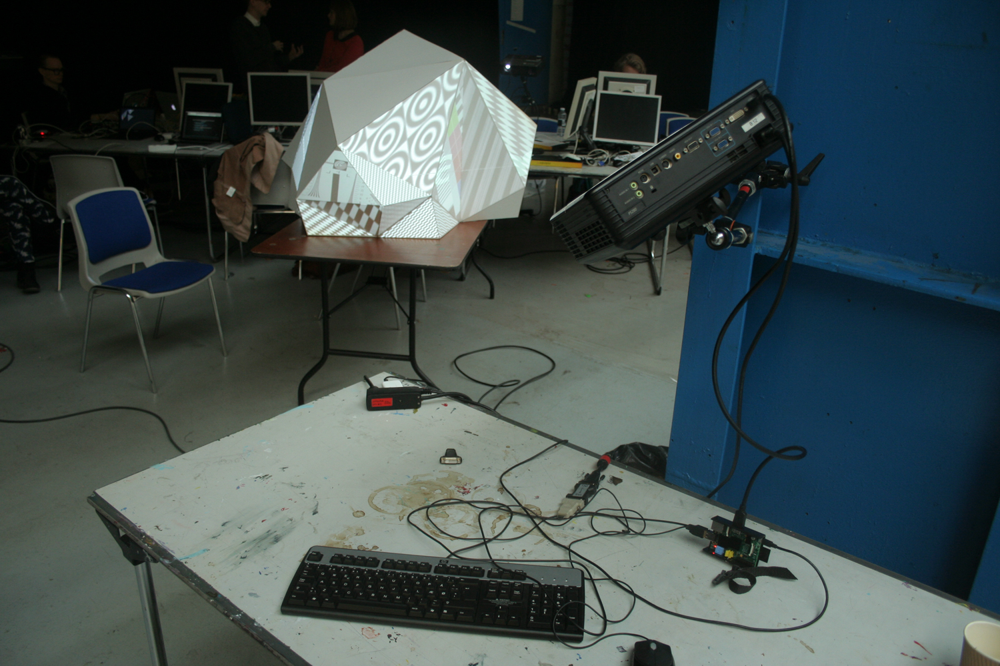

slidenumbers: true
autoscale: true
footer: © Krisjanis Rijnieks 2016



# [fit] Projection Mapping
# [fit] with Raspberry Pi_

---

# Introduction

Hello. How are you? Please introduce yourself.

- What is your name?
- What do you do?
- Why are you here?

---

# Krisjanis Rijnieks

- From Riga, Latvia
- MA in Arts and Design / Media Lab Helsinki
- Member of Pixelache Helsinki
- Developer of ofxPiMapper

---

# Projects

Projects range in complexity and usually include a combination of the following.

- Creative coding
- Projection mapping
- Digital fabrication

---


---


---


---

# Day 1

- Burning SD card
- Projection mapping
- Using own images and videos
- A bit of command line
- Pinch of openFrameworks

---

# Day 2

- openFrameworks recap
- Custom source development
- Setting up your project
- Synchronizing and projector blending
- Backing up SD card

---

# ofxPiMapper

We are going to use open source projection mapping addon for openFrameworks.

- Started as my MA thesis at Media Lab Helsinki
- Integrates with openFrameworks
- Runs also on Mac, Linux and Windows
- Available on GitHub

---

# Download

Please use the following link to download the image file.

**http://ej.uz/ofxpimapper20161125a**

---

# Burning SD Card

Please follow the link to access the instructions page.

**http://ej.uz/sd-card-burning-guides**

---

# Shortcuts

You can find an ever updating version of keyboard shortcuts on the ofxPiMapper GitHub repository.

**https://github.com/kr15h/ofxPiMapper**

---

# Experiment

---

# Own Sources

Use a USB flash drive and put some of these there.

- jpg
- png
- mp4

---

# Encoding Tools

- ffmpeg
- HandBrake
- Adobe Media Encoder
- MPEG Streamclip

---

# ffmpeg Commands

```
ffmpeg -i source.mov -vf scale=w=800:h=450 destination.mp4
```

---

# SSH

```
ssh pi@192.168.0.40
```

Username: pi
Password: raspberry

---

# [fit] Command Line 101

```
pwd             Print working directory
cd /my/dir      Change directory to /my/dir
cd ..           Change directory one level up
ls              List directory
ls -al          List directory with hidden files as a list
mkdir /my/dir   Make directory /my/dir
touch file.txt  Create empty file.txt
cat file.txt    Show file contents (best for small files)
less file.txt   Show file contents (good for longer text)   
```

---

# [fit] External Command Line Resources

There are a lot of useful guides out there on the Internet. Check out the following links.

- http://kr15h.github.io/rpi-console-intro/index.html
- http://linuxcommand.org/lc3\_learning\_the\_shell.php
- https://www.git-tower.com/learn/git/ebook/en/command-line/appendix/command-line-101

---

# [fit] Editing Text Files With Nano

The simplest command line text editor is `nano`. To open a file in nano, use the following command.

```
nano /path/to/your/file.txt
```

You can not use mouse in *nano*, navigation is possible with the arrow keys *(← ↑ → ↓)* on your keyboard. To close the file, press *ctrl + x*. Nano will prompt you whether you want to save changes. Press *y* if you do, you will have to press *enter* additionally to confirm the file name.

---

# [fit] Keeping System up to Date

Once in a while it is a good idea to update the system. To do that use the following commands.

```
sudo apt-get clean
sudo apt-get update
sudo apt-get upgrade
```

The *update* and *upgrade* commands will take a while. That's normal.

---

# [fit] Powering up and down

After an update or changes in configuration, one might want to reboot the system. Use the following command to do so.

```
sudo reboot
```

When changes have to be made to the SD card or the Raspberry Pi has to be shut down for another reason, use the command below.

```
sudo halt
```

---

# [fit] Uploading Own Sources
## The SD Card Way

You can copy small files directly onto the SD card in the *ofxpimapper/sources* directory. Place the video files in the *videos* directory and image files in the *images* directory.

---

# [fit] Uploading Own Sources
## The SFTP Way

Use FileZilla.

```
https://filezilla-project.org/
```

Use the same IP address as for the SSH part, the username *pi* and password *raspberry*. Use *port 22*. You can find the sources directory under the path below.

```
/home/pi/openFrameworks/addons/ofxPiMapper/example/bin/data/sources
```

---

# [fit] Launching on Boot
## Introducing Crontab

Use *Cron*. Cron is job scheduler software available on Unix-like systems like Linux. We are using Raspbian which is a Linux distribution for Raspberry Pi computers.

Run the following command to edit `crontab`.

```
crontab -e
```

---

# [fit] Launching on Boot
## Editing Crontab

You have to add the following line in order to launch ofxPiMapper on next boot.

```
@reboot /home/pi/openFrameworks/addons/ofxPiMapper/example/bin/example
```

If you want to reboot once a day at midnight, add the following (the first five symbols denote: *minute*, *hour*, *day of month*, *month*, *day of week*; *\** means all)

```
0 0 * * * reboot
```

---

# [fit] Killing

If you need to SSH into the Raspberry Pi after the autostart with crontab is set up to stop the software, you can do that. After logging in via SSH, run the following command to stop the ofxPiMapper process.

```
killall example
```

---

# [fit] Keeping ofxPiMapper up to date

You might want to update ofxPiMapper to be able to use the latest features. To do that, navigate to the *ofxPiMapper* directory first.

```
cd /home/pi/openFrameworks/addons/ofxPiMapper
```

Use git to *pull in* the latest changes. Make sure that you are connected to the internet.

```
git pull origin master
``` 

Then you will have to recompile the program by using the GNU *make* program.

```
make
```

---

# Backing up

Make sure that you do not expand the filesystem of the disk image provided during the workshop.

```
diskutil list
diskutil unmountDisk /dev/diskN
sudo dd if=/dev/rdiskN of=./backup.img bs=1m count=3700
```

---

# Changing WiFi Network

```
sudo nano /etc/wpa_supplicant/wpa_supplicant.conf
```

Change the `ssid` and `psk`.

```
network={
        ssid="Your SSID"
        psk="Your password"
}
```

---

# [fit] Installing openFrameworks

Once you have the OS (like Raspbian) installed on your SD card, the next step is to install *openFrameworks*. To do that, follow the guide available on the official openFrameworks website.

```
http://openframeworks.cc/setup/raspberrypi/raspberry-pi-getting-started/
```

---

# [fit] Installing ofxPiMapper

Use the following.

```
cd /home/pi/openFrameworks/addons
git clone https://github.com/kr15h/ofxPiMapper.git
git clone https://github.com/jvcleave/ofxOMXPlayer.git
git clone https://github.com/bakercp/ofxIO.git
cd /home/pi/openFrameworks/addons/ofxPiMapper/example
make
```

---

# Thank you!

If you notice that something is missing, please add an issue.

[^1]: Image source: Google Cultural Institute
