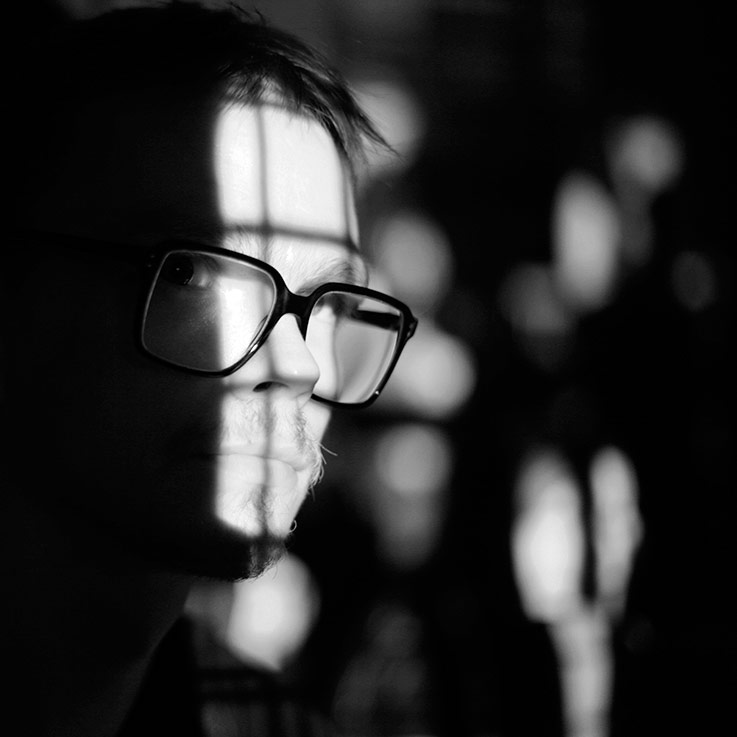
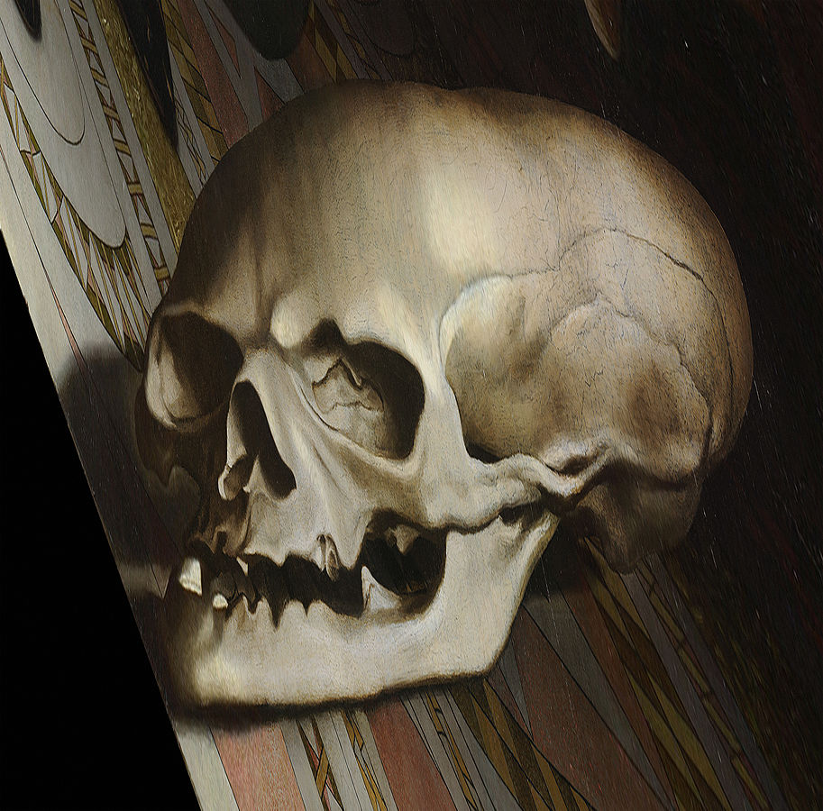
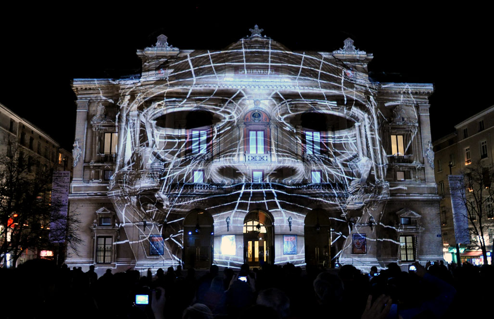
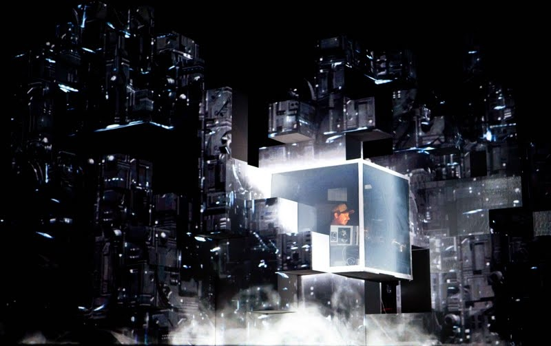

slidenumbers: true


# Projection Mapping with the Raspberry Pi

Krisjanis Rijnieks
Spektrum Berlin
26 March 2016

<sub>Background image: Projection Mapping with the Raspberry Pi workshop during the Click Festival 2013 in Helsingor, Denmark. In collaboration with Irina Spicaka and Pixelache Helsinki.</sub>

---

## Facts About Krisjanis Rijnieks

 - From Riga, Latvia
 - Studied New Media at the Helsinki Media Lab
 - Currently is a part of the Fab Lab Berlin family
 - Is developing ofxPiMapper and running projection mapping workshops
 - Likes Spektrum Berlin



---

## More About Krisjanis Rijnieks

**Website**
http://rijnieks.lv

**GitHub**
https://github.com/kr15h

**LinkedIn**
https://www.linkedin.com/in/krisjanisrijnieks


---

## What is Projection Mapping

One can turn almost any surface into a screen by using projection mapping.[^1]


---

## What is Projection Mapping

Here is what you need.

 - A computer
 - A projector
 - A surface
 - Some electricity


---

## History

In fact, projection mapping is nothing new. Hans Holbein the Younger did it in 1533 already.[^2]


---

## History

He used anamorphism, perspective distortion, to paint the symbols of mortality and death into his project so it can only be seen from an angle.[^3]



---

## Current Status

Currently projection mapping is mostly associated with transforming the facades of historical buildings.[^4]



---

## Current Status

Or stage design for electronic music shows like the ISAM project by Amon Tobin.[^5]



---

## Today

We are going to have a quick walktrhough on how to set up a simple projection mapping installation by using ofxPiMapper and the Raspberry Pi mini-computer.


---

## Today

**The plan**

1. Install Raspbian
2. Configure Raspberry Pi
3. Install openFrameworks and ofxPiMapper
4. Have fun with projection mapping


---

## Step 1

### Installing Raspbian

1. Get a Class 10 micro SD card. 8GB is fine.
2. Download Raspbian from **raspberrypi.org/downloads**
3. Burn the Raspbian disk image onto the SD card

```
diskutil list
diskutil unmountDisk /dev/diskN
sudo dd if=/path/to/rpi/image.img of=/dev/rdiskN bs=2m
```

---

## Step 2

### Starting up the first time

1. Login using username **pi** and password **raspberry**
2. Launch config by typing ```
sudo raspi-config```
3. Expand filesystem
4. Set memory split to at least 128MB
5. Reboot

---

## Step 3

### Download and install openFrameworks

Follow the instructions on **openframeworks.cc**.

http://openframeworks.cc/setup/raspberrypi/raspberry-pi-getting-started/

---

## Step 4

### Download and install ofxPiMapper

- **Make sure that git is installed** ```
sudo apt-get install git```
- **Navigate to openFrameworks addons directory** ```
cd /home/pi/openFrameworks/addons```
- **Clone the ofxPiMapper git repository** ```
git clone https://github.com/kr15h/ofxPiMapper.git```

---

## Step 4

### Download and install ofxPiMapper

- **Clone dependencies** ```
git clone https://github.com/jvcleave/ofxOMXPlayer.git && git clone https://github.com/bakercp/ofxIO.git```
- **Go inside ofxPiMapper example directory** ```
cd /home/pi/openFrameworks/addons/ofxPiMapper/example```
- **Compile and run** ```
make && make run```

---

## What now?

Unfortunately this workshop is too short to show everything. Now you might be interested into the following topics.

- Launching fullscreen with the -f flag
- Launch on boot
- Custom generative sources

---

## Ad Alert

There is a way. Join the Projection Mapping with the Raspberry Pi workshop on May 14 and 15 at the Fab Lab Berlin!

More info https://fablab.berlin/en/23-courses

---

#Have fun with projection mapping!


[^1]: Image from projection mapping workshop by Krisjanis Rijnieks and Irina Spicaka during the School of Machines in Berlin, 2014

[^2]: Image source: Google Cultural Institute

[^3]: Image source: Google Cultural Institute

[^4]: 3D Projection Mapping performance during Fête des Lumières, Lyon, France (2010) Artists: 1024 architecture (Photos: Daniela Krautsack)

[^5]: Image source denverlibrary.org